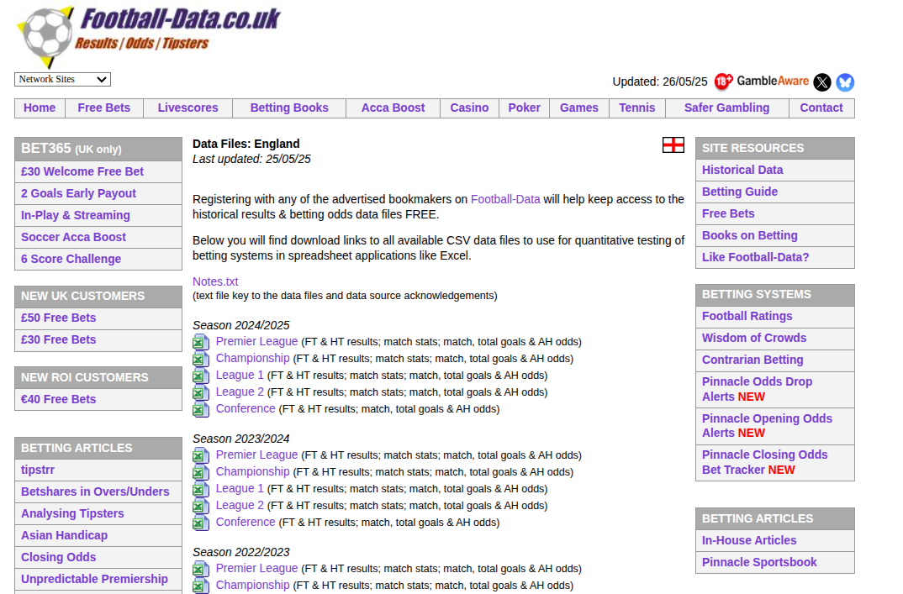
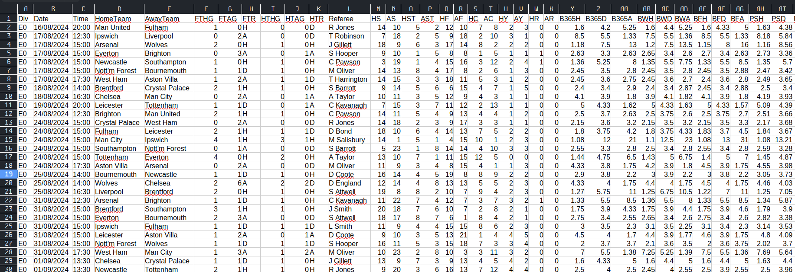
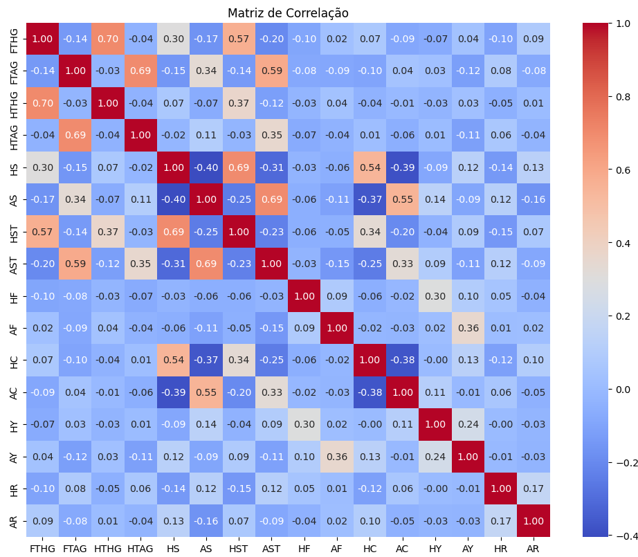
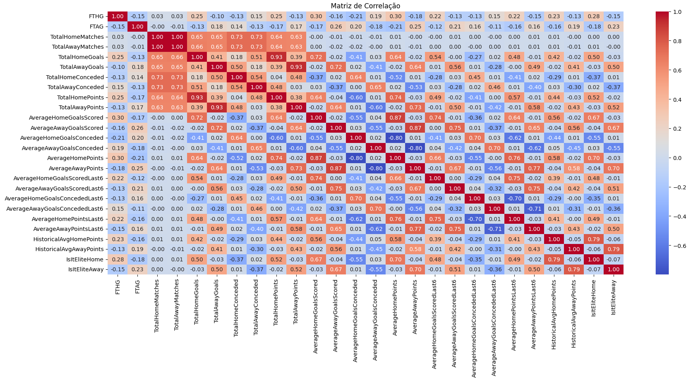
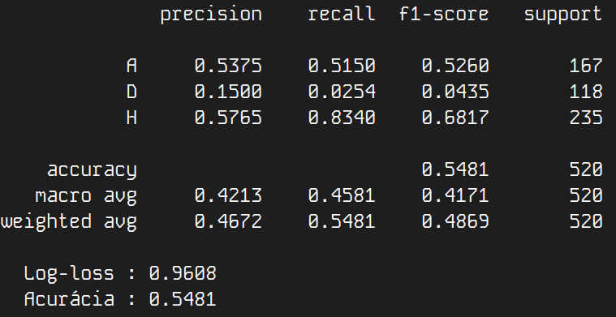
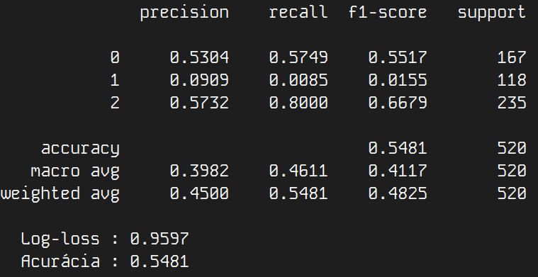
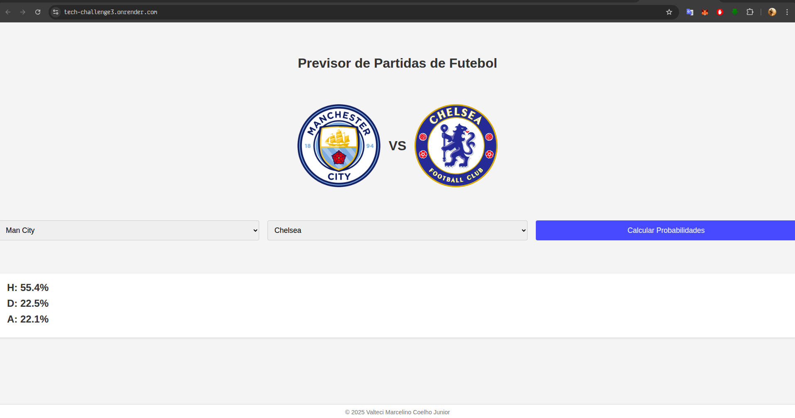

# Tech Challenge – Fase 3

> Neste repositório, apresentamos a solução completa para o Tech Challenge Fase 3, em que foi um modelo de Machine Learning integrado a um pipeline de dados e a uma aplicação produtiva (um site) que consome esse modelo por meio de uma API.

## Índice

* [Introdução](#introdução)
* [Fontes de dados usadas](#fontes-de-dados-usadas)
* [Análise exploratória dos dados](#análise-exploratória-dos-dados)
* [Modelos utilizados](#modelos-utilizados)
* [Resultados obtidos](#resultados-obtidos)
* [Pipeline](#pipeline)
* [Arquitetura](#arquitetura)
* [Como rodar o projeto](#como-rodar-o-projeto)
* [Deploy](#deploy)

---

## Introdução

O projeto teve como foco criar um modelo de Machine Learning para predizer resultados de partidas de futebol do campeonato inglês (Premier League). O modelo foi treinado com uma base de dados pública e seu objetivo é tentar prever o resultado de uma partida de futebol, ou seja, dado um time que joga em casa e um time que joga como visitante, o modelo vai prever qual a probabilidade do time que joga em casa ganhar (H - home), qual a probabilidade de empate (D - draw) e qual a probabilidade do time visitante vencer (A - away).

Dado esse contexto, pode-se dizer que o problema se trata de um problema de aprendizado supervisionado de classificação, em que o modelo vai tentar prever a probabilidade de 3 classes: H, D, A. O modelo foi treinado com algoritmos de classificação, e foram usadas medidas como: total de gols marcados, total de pontos, total de gols sofridos e se um time é considerado um time de elite.

Por fim, foi implantado um site em produção para consumo do modelo em tempo real no [Render](https://render.com/). O site está disponível aqui: https://tech-challenge3.onrender.com/


## Fontes de dados usadas

A fonte de dados utilizada pode ser encontrada no [football-data](https://www.football-data.co.uk/englandm.php). É um grande site que contém várias bases de dados relacionadas ao futebol. O football-data disponibiliza dados de vários campeonatos pelo mundo em forma de arquivos .csv, o que facilita bastante o consumo desses dados.

Além disso, o football-data é estruturado de uma maneira amigável ao scraping desses arquivos .csv, o que facilita um fluxo de pipeline de dados, por exemplo.

Dadas essas características, foi construído um mecanismo de scraping no arquivo **MLpipeline/downloader.py** que tem como objetivo baixar os arquivos .csv desse site e armazená-los numa pasta chamada data/england/premier_league.

Os arquivos .csv foram salvos seguindo uma nomenclatura em que os primeiros 2 dígitos representam o ano de início da temporada e os 2 último dígitos representam o último ano da temporada. Então o arquivo 9394.csv se refere-se aos dados da temporada de 1993-1994, o 0102 seria o da temporada de 2001-2002. Isso porque a Premier League começa em agosto de um ano e termina em maio do ano seguinte.

Abaixo, uma imagem do site football-data:



## Análise exploratória dos dados

### Entendendo as colunas
Os dados coletados têm dezenas de colunas, que podemos dividir em grupos para facilitar o entendimento (para saber o significado de cada coluna, veja o arquivo [notes.txt](./notes.txt) fornecido pelo site oficial).

Basicamente, existem 2 tipos de colunas nessa base de dados bruta, as colunas que representam estatísticas que ocorreram nos jogos (número de gols, faltas, etc) e probabilidades de várias casas de apostas relacionada aos eventos, por exemplo, a probabilidade de sair mais 2 gols num jogo. A coluna target é a coluna FTR (Full Time Result), pois é ela que contém o resultado final da partida. O foco foi nas colunas de estatísticas e são elas que vamos explicar melhor, mas nem todas elas foram usadas:

- **Div**: representa a divisão do campeonato, a inglaterra tem várias divisões, algo como série A ou série B aqui no Brasil. Nessa base dados, a Premier League (primeira divisão) recebeu o valor de E0.

- **Date**: data em que ocorreu o jogo.

- **Time**: hora do dia em que a partida iniciou.

- **HomeTeam**: nome do time que está jogando em casa.

- **AwayTeam**: nome do time que está jogando como visitante.

- **FTHG**: é uma abreviação para "Full Time Home Goals", ou seja, quantos gols o time da casa marcou no tempo total de jogo.

- **FTAG**: é uma abreviação para "Full Time Away Goals", ou seja, quantos gols o time visitante marcou no tempo total de jogo.

- **FTR**: é uma abreviação para "Full Time Result", ou seja, é o resultado da partida e pode ter 3 valore: H (o time da casa venceu), D (empate) ou A (o time visitante venceu).

- **HTHG**: é uma abreviação para "Half Time Home Goals", ou seja, quantos gols o time da casa marcou no primeiro tempo.

- **HTAG**: é uma abreviação para "Half Time Away Goals", ou seja, quantos gols o time visitante marcou no primeiro tempo.

- **HTR**: é uma abreviação para "Half Time Result", ou seja, quem venceu o primeiro tempo do jogo.

- **Referee**: é nome do juiz da partida.

- **HS**: é uma abreviação para "Home shots", ou seja, é o número de chutes ao gol do time da casa.

- **AS**: é uma abreviação para "Away shots", ou seja, é o número de chutes ao gol do time visitante.

- **HST**: é uma abreviação para "Home Shots on Target", ou seja, é o número de chutes ao gol do time da casa no gol (não considera chutes para fora).

- **AST**: é uma abreviação para "Away Shots on Target", ou seja, é o número de chutes ao gol do time visitante no gol (não considera chutes para fora).

- **HF**: é uma abreviação para "Home Fouls", ou seja, o número de faltas cometidas pelo time da casa.

- **AF**: é uma abreviação para "Away Fouls", ou seja, o número de faltas cometidas pelo time visitante.

- **HC**: é uma abreviação para "Home Corners", ou seja, o número de escanteios cobrados pelo time da casa.

- **AC**: é uma abreviação para "Away Corners", ou seja, o número de escanteios cobrados pelo time visitante.

- **HY**: é uma abreviação para "Home Yellow Cards", ou seja, o número de cartões amarelos que o time da casa recebeu.

- **AY**: é uma abreviação para "Away Yellow Cards", ou seja, o número de cartões amarelos que o time visitante recebeu.

- **HR**: é uma abreviação para "Home Red Cards", ou seja, o número de cartões vermelhos que o time da casa recebeu.

- **AR**: é uma abreviação para "Away Red Cards", ou seja, o número de cartões vermelhos que o time visitante recebeu


Abaixo, está uma imagem dos dados brutos de um csv da base de dados:



### Multicolinearidade

Durante a análise exploratória dos dados, foi possível observar que diversas variáveis da base apresentavam alta correlação entre si, o que pode indicar a presença de multicolinearidade. A multicolinearidade ocorre quando duas ou mais variáveis independentes carregam informações muito semelhantes, dificultando a interpretação dos coeficientes em modelos preditivos e, em alguns casos, prejudicando o desempenho do modelo.

No nosso caso, pode-se ver claramente que quanto mais gols o time marca, por exemplo, mais escanteios ele vai ter e provavelmente menos cartões amarelos e vermelhos ele vai levar. Da mesma forma, quanto mais gols um time fez, provavelmente, mais chute ao gol ele deu.

Rodando o script presente em /scripts/matriz_correlacao.py podemos perceber que há grande correlação entre algumas variáveis da base de dados, algumas variáveis chegam a ter correlação com 2 ou até 3 outras variáveis da base de dados (multicolinearidade)

Abaixo temos a matriz de correlação de um dos CSVs da nossa base de dados bruta:
 


### Gerando novas features
A partir das features que já estão nos CSVs, foi possível gerar novas features que ajudaram bastante o desempenho dos modelos. A features foram geradas nos arquivos /MLpipeline/preprocessing.py.

Features Geradas:
- **Gols marcados**: representa o total de gols marcados por um time na temporada em todos os jogos anteriores naquela mesma temporada. Tem o propósito de avaliar a força ofensiva geral do time na temporada. Foi adicionado à base de dados com os nomes: TotalHomeGoals e TotalAwayGoals.

- **Gols sofridos**: representa o total de gols sofridos por um time na temporada em todos os jogos anteriores naquela mesma temporada. Tem o propósito de avaliar a força defensiva geral do time na temporada. Foi adicionado à base de dados com os nomes: TotalHomeConceded e TotalAwayConceded.

- **Total de partidas jogadas**: representa o total de partidas jogadas por um time no campeonato da premier league. A premier League tem no total 38 partidas. Alguns times tendem a jogar de maneiras diferentes em relação ao final ou ao início da competição. Foi adicionado à base de dados com os nomes: TotalHomeMatches e TotalAwayMatches.

- **Total de pontos**: representa o total de pontos que um time fez em todas as partidas anteriores daquele campeonato. Tem o propósito de avaliar o desempenho geral time na competição. Foi adicionado à base de dados com os nomes: TotalHomePoints e TotalAwayPoints

- **Time elite**: é uma feature booleana e representa se o time é ou não de elite. Um time é elite se ele é um dos seguinte times: [Man City, Man United, Liverpool, Chelsea, Tottenham]. Esses times são historicamente ricos e com grandes torcidas, o que dá a eles muita vantagem frente a outros times. Por isso foi colocada essa feature para sinalizar a presença desses times na partida, essa feature aumentou consideravelmente o desempenho do modelo. Foi adicionada à base de dados com os nomes: IsItEliteHome e IsItEliteAway

- **Features de média**: Foram criadas médias das features anteriores, ou seja, média de gols marcados por um time, média de gols sofridos, média pontos por partida. Também foi criado média das últimas 6 partidas e também uma média histórica de total de ponto que representa quantos pontos um time fez em média por campeonato desde 1993. As seguintes features foram adicionadas ao database: AverageHomeGoalsScored, AverageAwayGoalsScored, AverageHomeGoalsConceded, AverageAwayGoalsConceded, AverageHomePoints,
AverageAwayPoints, AverageHomeGoalsScoredLast6, AverageAwayGoalsScoredLast6, AverageHomeGoalsConcededLast6, AverageAwayGoalsConcededLast6, AverageHomePointsLast6, AverageAwayPointsLast6, HistoricalAvgHomePoints e HistoricalAvgAwayPoints.


### Features selecionadas
Apesar de gerar várias features novas, apenas algumas foram usadas para treinar o modelo, isso porque muitas delas apresentavam auto grau de correlação, mesmo as novas features apresentaram um alto grau de correlação, como pode ser visto a matriz de correlação abaixox com todas as features geradas pelo modelo:



Dado esse contexto, a combinação de feature que gerou o melhor resultado foi a seguinte e foram elas que foram selecionadas para treinar o modelo: ['TotalHomeGoals', 'TotalAwayGoals', 'TotalHomeConceded', 'TotalAwayConceded', 'TotalHomePoints', 'TotalAwayPoints', 'IsItEliteHome', 'IsItEliteAway']

Dados como número de faltas, cartões, dia e tempo da partida, também não ajudaram no desempenho dos modelos.

### Falta de dados
Apesar de haver dados de todos os jogos da Premier League desde 1993, infelizmente, não foi possível achar dados da formação das equipes no momento do jogo, ou seja, se um time estava com desfalques, se estava poupando jogadores para um jogo mais importante ou se estava jogando com um time alternativo. Essas informações têm grande influência nos resultados da partida e muitos jogos na base de dados são afetados por essa condição, porém não foi possível passar essa informação ao modelo pela falta desses dados.

O modelo poderia ter se saído muito melhor se tivesse com esses dados, já que, às vezes, um time perde um jogo não porque está ruim, mas porque não está jogando com sua força total.


## Modelos utilizados
3 modelos foram utilizados e testados nesse projeto: regressão logística, lightgbm e XGboost. Os modelos foram implementados dentro do arquivo /MLpipeline/model.py

Para escolher qual modelo utilizar na hora de rodar a aplicação, altere a função "load_model" que está dentro de MLpipeline/pipeline.py, nesse caso, você precisa alterar a string do parâmetro que está sendo passado pela função. Está sendo usado regressão logística, mas os possíveis valores são esse:
- logistic_regression
- lightgbm
- xgboost

Cada um deles carrega o modelo correspondente para ser usado pela aplicação.


## Resultados obtidos

Para ver os resultados obtidos sendo gerados de fato pelo código, basta executar o código e as informações de desempenho do modelo vão aparecer no console da aplicação, conforme o modelo selecionado.

Foram utilizados as métricas de log-loss e matriz de confusão como métricas dos modelos. O log-loss representa o quão bom o modelo é em prever as probabilidades das classes e não se importa muito com a classe em si prevista, o que no contexto desse projeto é adequado, já que é preciso saber a probabilidade da classe e não qual delas vai acontecer.

### Regressão logística


___________________________________________

### lightgbm


___________________________________________

### XGboost



## Como rodar o projeto

Caso queira rodar esse projeto localmente no windows, recomenda-se usar o docker. Caso não tenha docker, [baixe aqui](https://docs.docker.com/get-started/get-docker/). Para rodar a aplicação em docker use os comandos abaixo:
```bash
docker build -t projeto-ml .
```

Depois, basta executar o comando abaixo para o site começar a rodar localmente:
```bash
docker run -dp 3000:3000 --name site projeto-ml
```

Depois disso, basta acessar o site por meio da url: http://127.0.0.1:3000/


Caso queira rodar a aplicação localmente, crie um ambiente virtual python, ative o ambiente virtual, instale as dependências presentes no arquivo requirements.txt e por fim execute o comando "flask run --port=3000" na raiz do projeto. Depois disso, basta acessar o site por meio da url: http://127.0.0.1:3000/


## Deploy

O projeto foi implantado como uma site no Render e está acessível pela seguinte URL: https://tech-challenge3.onrender.com/

Imagem do site do projeto:

